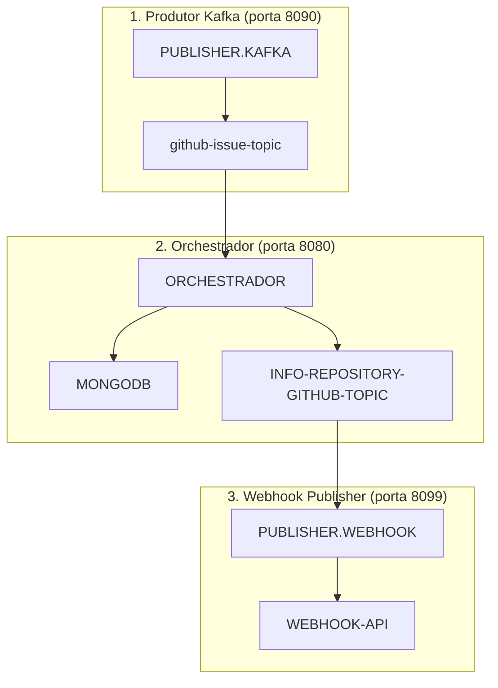

# PUBLISHER.WEBHOOK - Serviço de Publicação Webhook

## Descrição

Este microsserviço é o **componente final** no fluxo de processamento da aplicação. É responsável por consumir mensagens do tópico Kafka publicadas pelo Orchestrador e enviá-las para um endpoint webhook externo, completando o fluxo de processamento de dados.

**Parte 3 do fluxo integrado de 3 microsserviços:**
1. [Producer Kafka](../swap-producer-kafka/README.md) - Recebe solicitações e publica no Kafka
2. [Orchestrador](../swap-orchestrador/README.md) - Consome mensagens, processa e persiste no MongoDB
3. **Webhook Publisher (este)** - Publica informações via webhook

## Tecnologias Utilizadas

- Java 17
- Spring Boot 3.3.4
- Apache Kafka e Avro
- Resilience4j (Circuit Breaker)
- RestTemplate para chamadas HTTP
- Maven

## Pré-requisitos

- Java 17
- Maven
- Docker e Docker Compose (para ambiente de infraestrutura)
- Git

## Como Executar

### 1. Preparando o Ambiente de Infraestrutura

Para executar toda a aplicação integrada usando o Docker Compose da raiz do projeto:

```bash
# Na raiz do projeto
docker-compose up -d
```

### 2. Ordem de Execução dos Microsserviços

Para garantir o funcionamento correto da solução completa, inicie os serviços na seguinte ordem:

1. Infraestrutura (Kafka, Schema Registry, MongoDB)
2. [Producer Kafka](../swap-producer-kafka/README.md) - porta 8090
3. [Orchestrador](../swap-orchestrador/README.md) - porta 8080
4. **Webhook Publisher (este serviço)** - porta 8099

### 3. Executando Este Serviço

#### Utilizando Maven
```bash
# Compilar o projeto
mvn clean package

# Executar a aplicação
mvn spring-boot:run
```

#### Utilizando JAR
```bash
# Após compilar o projeto
java -jar target/webhook-publisher-0.0.1-SNAPSHOT.jar
```

#### Utilizando Docker
```bash
# Na raiz deste projeto
docker build -t webhook-publisher .
docker run -p 8099:8099 webhook-publisher
```

### 4. Verificando o Status

O serviço estará disponível em http://localhost:8099
Endpoints de monitoramento: http://localhost:8099/actuator/health

## Arquitetura da Solução Completa



## Configurações

As principais configurações podem ser ajustadas no arquivo `application.properties` ou via variáveis de ambiente:

```properties
# Servidor
server.port=8099

# Kafka
app.kafka.bootstrap-servers=kafka:9092
app.kafka.schema-registry-url=http://schema-registry:8081
app.kafka.consumer.github-info.topic=INFO-REPOSITORY-GITHUB-TOPIC
app.kafka.consumer.group-id=consumer-group-id

# Webhook
app.client.webhook.repository-info.path=https://webhook.site/7995360f-773a-4a8d-b030-98d7642e3b84
app.client.webhook.connection-timeout=5000
app.client.webhook.read-timeout=10000
```

## Testando o Webhook

1. Acesse [webhook.site](https://webhook.site/) para gerar um novo endpoint de teste
2. Atualize a configuração `app.client.webhook.repository-info.path` com seu novo URL
3. Execute o fluxo completo para verificar se as mensagens chegam ao endpoint webhook

## Links para os Outros Microsserviços

Este serviço faz parte de uma solução composta por três microsserviços:

1. [Publisher Kafka](../swap-producer-kafka/README.md) - Ponto de entrada que recebe requisições REST e publica no Kafka
2. [Orchestrador](../swap-orchestrador/README.md) - Middleware que processa dados, persiste no MongoDB e publica em outro tópico
3. **Webhook Publisher (este)** - Serviço final que consome do Kafka e publica via webhook

## Fluxo Completo de Dados

Para testar o fluxo completo:

1. Envie uma mensagem através do Producer Kafka
2. O Orchestrador processará e enriquecerá os dados
3. Este serviço receberá a mensagem processada e a enviará para o webhook
4. Verifique o recebimento no webhook configurado

## Troubleshooting

Se encontrar problemas:

1. Verifique se os tópicos Kafka foram criados corretamente
2. Confirme se o Orchestrador está enviando mensagens no formato correto
3. Teste a conectividade com o endpoint webhook manualmente
4. Verifique os logs da aplicação para identificar erros específicos
5. Confirme se o circuit breaker está configurado corretamente


