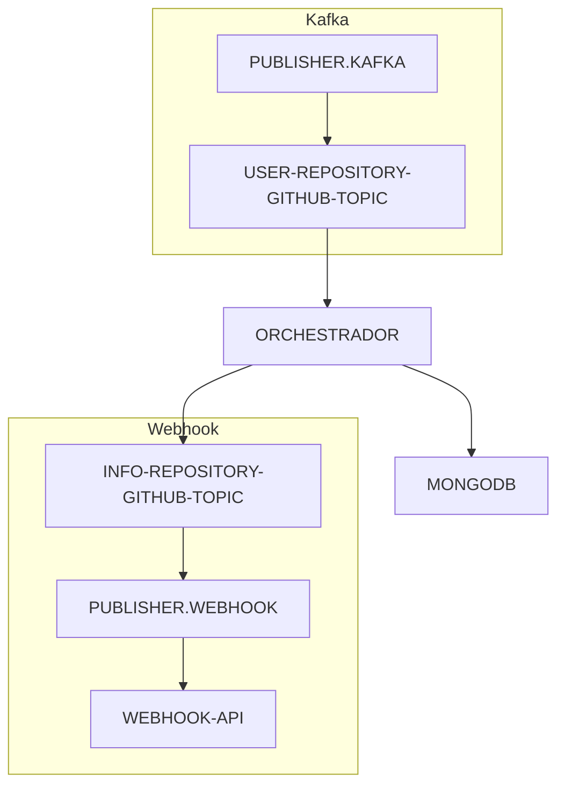

# PUBLISHER.WEBHOOK #

### Consome dados do tópico e publica via webhook ###

### Requisitos ###
Java 17

### Requisitos de teste ###
Docker

### Para executar a aplicação ###
[Execute os containers de acordo da aplicação orchestrador](https://github.com/flpfraga/swap-orchestrador/blob/master/README.md)

Inicie a aplicação.

Inicie a aplicação que busca dados de outras APIs
[orchestrador](https://github.com/flpfraga/swap-orchestrador)

Inicie a aplicação que consome dados do tópico INFO-REPOSITORY-GITHUB-TOPIC e publica via Webhooks
[publisher.kafa](https://github.com/flpfraga/swap-producer-kafka)

Arquitetura da solução

